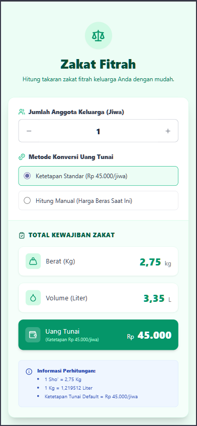

# Kalkulator Zakat Fitrah

Sebuah kalkulator zakat fitrah berbasis web yang sederhana, modern, dan interaktif. Dibuat untuk membantu pengguna menghitung kewajiban zakat fitrah mereka dengan mudah, baik dalam bentuk bahan makanan pokok (beras) maupun dalam bentuk uang tunai (Rupiah).



## ✨ Fitur Utama

- **Perhitungan Dinamis**: Hitung total zakat berdasarkan jumlah anggota keluarga (jiwa).
- **Satuan Lengkap**: Tampilkan hasil dalam satuan berat (**Kilogram**), volume (**Liter**), dan mata uang (**Rupiah**).
- **Opsi Konversi Uang**:
    - **Ketetapan Standar**: Gunakan tarif tetap yang sudah ditentukan (misal: Rp 45.000 per jiwa).
    - **Hitung Manual**: Hitung berdasarkan harga beras yang dikonsumsi saat ini untuk akurasi yang lebih tinggi.
- **Input Harga Fleksibel**: Mendukung input harga beras per **Kg** atau per **Liter**.
- **UI Interaktif**: Antarmuka yang bersih dan responsif, dibangun dengan Alpine.js untuk pengalaman pengguna yang lancar tanpa perlu me-refresh halaman.
- **Informasi Transparan**: Menampilkan dasar perhitungan yang digunakan (1 Sho', konversi Kg ke Liter, dll).
- **Zero-Dependency**: Cukup satu file `index.html`, tidak memerlukan proses build atau instalasi yang rumit.

## 🛠️ Teknologi yang Digunakan

- **HTML5**: Struktur dasar halaman.
- **Tailwind CSS**: Untuk styling antarmuka yang modern dan responsif.
- **Alpine.js**: Untuk menambahkan interaktivitas JavaScript langsung di dalam markup HTML.
- **Lucide Icons**: Untuk ikon-ikon yang bersih dan ringan.

## 🚀 Cara Menggunakan

Tidak ada proses instalasi yang diperlukan. Cukup unduh atau kloning repositori ini, lalu buka file `index.html` di browser web favorit Anda.

```bash
# Jika menggunakan git
git clone https://github.com/username/repo-kalkulator-zakat.git
cd repo-kalkulator-zakat
# Buka file index.html di browser
```

**Langkah-langkah di aplikasi:**
1.  Masukkan **Jumlah Anggota Keluarga**.
2.  Hasil dalam **Berat (Kg)** dan **Volume (Liter)** akan langsung ditampilkan.
3.  Untuk mengetahui nilai dalam **Uang Tunai**, pilih salah satu metode:
    - **Ketetapan Standar**: Langsung menampilkan total berdasarkan tarif default.
    - **Hitung Manual**: Masukkan harga beras per Kg atau per Liter yang biasa Anda konsumsi. Total akan dihitung secara otomatis.

## Basis Perhitungan

Kalkulator ini mengacu pada standar berikut:
- **1 Sho'**: `2.75 Kg`
- **Konversi Liter**: `1 Kg` beras dianggap setara dengan `1.219512 Liter`.
- **Tarif Tunai Default**: `Rp 45.000` per jiwa (dapat diubah di dalam kode).
